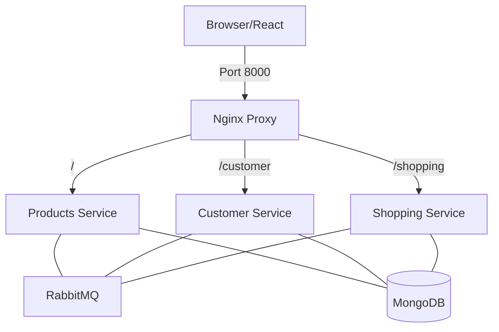

# Ecommerce Microservice Application

A modern, scalable ecommerce platform built with a microservices architecture using Node.js, Express, MongoDB, RabbitMQ, and React.

## 🚀 Architecture Overview



This application consists of several microservices that communicate asynchronously using **RabbitMQ** and are served through an **Nginx API Gateway**.

- **Customer Service**: Handles authentication, user profiles, and address management.
- **Product Service**: Manages the product catalog and inventory.
- **Shopping Service**: Handles cart management, order processing, and transaction history.
- **API Gateway**: Consolidates all services under a single port (8000) and handles CORS.
- **Frontend**: A React-based web interface for consumers. Includes administrative features (e.g., product creation) accessible to authorized users.
- **Message Broker**: Enables decoupled communication (e.g., notifying Customer service when a product is added to a wishlist).

---

## 🛠 Prerequisites

Before you begin, ensure you have the following installed:
- [Docker](https://www.docker.com/get-started)
- [Docker Compose](https://docs.docker.com/compose/install/)
- [Node.js](https://nodejs.org/) (v16+ recommended for local development)

---

## 🚦 Getting Started

### Quick Start with Docker

The easiest way to run the entire stack is using Docker Compose.

#### Development Mode:
```bash
docker-compose up --build
```

#### Production Mode (Simulated):
```bash
docker-compose -f docker-compose.prod.yml up --build
```

### Accessing the Application:
- **Frontend**: [http://localhost:3000](http://localhost:3000)
- **API Gateway**: [http://localhost:8000](http://localhost:8000)
- **RabbitMQ Management**: [http://localhost:15672](http://localhost:15672)

---

## 💻 Technology Stack

- **Backend**: Node.js, Express.js
- **Database**: MongoDB (NoSQL) with Mongoose ODM
- **Messaging**: RabbitMQ (AMQP 0-9-1)
- **Frontend**: React.js with Tailwind CSS
- **DevOps**: Docker, Kubernetes (AKS), Terraform

---

## 📊 Database & Schemas

Each microservice maintains its own isolated database to ensure data ownership and independent scaling.

### Product Schema
| Field | Type | Description |
| :--- | :--- | :--- |
| `name` | String | Product name |
| `desc` | String | Detailed description |
| `type` | String | Category (e.g., 'tools', 'clothing') |
| `price` | Number | Unit price |
| `unit` | Number | Stock quantity |

### Customer Schema
| Field | Type | Description |
| :--- | :--- | :--- |
| `email` | String | Unique user email |
| `password` | String | Bcrypt-hashed password |
| `address` | Array | List of user addresses |
| `cart/wishlist`| Array | Stored items for persistence |

---

### Local Development

If you want to run services individually for development:

1. **Start Infrastructure Services:**
   Run only the database and message broker:
   ```bash
   docker-compose up nosql-db rabbitmq
   ```

2. **Configure Environment Variables:**
   Each service in `backend/` has a `.env.dev` file. Ensure the following variables are correctly set:
   - `MONGODB_URI`: Connection string for MongoDB.
   - `MSG_QUEUE_URL`: Connection string for RabbitMQ.
   - `PORT`: Service-specific port.

3. **Install Dependencies and Start Services:**
   For each service (customer, products, shopping):
   ```bash
   cd backend/<service-name>
   npm install
   npm run dev
   ```

4. **Start the Frontend:**
   ```bash
   cd frontend
   npm install
   npm start
   ```

---

## 📡 API Port Mapping

| Component | Host Port | Internal Port | Protocol | Description |
| :--- | :--- | :--- | :--- | :--- |
| **Frontend** | 3000 | 80 | HTTP | React Web App |
| **API Gateway** | 8000 | 8000 | HTTP | Entry point for all APIs |
| **Customer Service** | 8001 | 8001 | HTTP | User & Auth Logic |
| **Product Service** | 8002 | 8002 | HTTP | Catalog & Seed Scripts |
| **Shopping Service** | 8003 | 8003 | HTTP | Orders & Cart |
| **MongoDB** | 27018 | 27017 | TCP | Shared NoSQL Instance |
| **RabbitMQ** | 5672 | 5672 | AMQP | Message Broker |

---

## 🔄 Event-Driven Communication

The services use a **Direct Exchange** pattern in RabbitMQ to handle inter-service events:

1. **ADD_TO_WISHLIST**: `Products` -> `Customer`
2. **ADD_TO_CART**: `Products` -> `Customer` & `Shopping`
3. **PLACE_ORDER**: `Shopping` -> `Customer`

Messages are published to the `ONLINE_STORE` exchange.

---

## 🧪 Database Seeding

To populate the database with initial product data:

```bash
# Using Docker
docker exec -it products npm run seed

# Using local Node (if DB is running)
cd backend/products && npm run seed
```

---

## 🚢 Cloud Deployment (Azure AKS)

The repository includes a full automation suite for deploying to **Azure Kubernetes Service (AKS)**:

1. **Infrastructure**: Terraform scripts in `azure/` to provision ACR and AKS.
2. **Automation**: `azure/setup.sh` handles the entire pipeline:
   - Azure Login & Terraform Apply.
   - Docker Build & Push to ACR.
   - Kubernetes manifest deployment.
   - Ingress & HTTPS (Let's Encrypt) configuration.

**To deploy:** `cd azure && ./setup.sh`

---

## 🎥 Project Demo Guide

For your submission video (max 20 mins), we recommend this flow:
1. **Intro**: Project objective & architecture overview.
2. **Setup**: Run `docker-compose up` and show services starting.
3. **Seeding**: Run `docker exec -it products npm run seed`.
4. **Features**: Demo user registration, adding products to cart, and placing an order.
5. **Real-time Logs**: Show RabbitMQ messages being processed in the terminal.
6. **Cloud**: Briefly show the K8s manifests and Azure setup scripts.

---

## 🔧 Troubleshooting

- **RabbitMQ ECONNREFUSED**: Ensure the `rabbitmq` container is healthy before services start.
- **MongoDB Auth**: In K8s, credentials are managed via `k8s/infrastructure/mongodb/secret.yaml`.
- **CORS**: Route all requests through the Gateway (Port 8000).

---

## 📄 License

This project is licensed under the MIT License.
